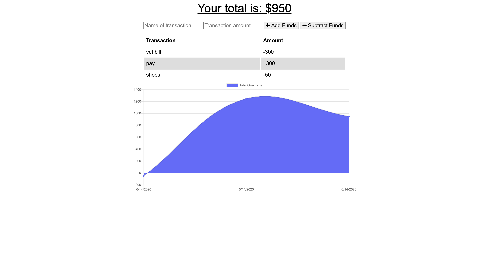

# budgetTracker

   

## Description

Add functionality to our existing Budget Tracker application to allow for offline access and functionality.

The user will be able to add expenses and deposits to their budget with or without a connection.

When entering transactions offline, they should populate the total when brought back online.

Offline Functionality:

Enter deposits offline

Enter expenses offline

When brought back online:

Offline entries should be added to tracker.

## 🚀 How to Use?

https://frozen-woodland-94568.herokuapp.com/

## 🤝 Contributing

Contributions, issues and feature requests are welcome. 
[Check the contributing guidelines] 

## Author

👤 **Max Semegen**

## 📝 License

Copyright © 2020 [Max Semegen](https://github.com/Maxsem4). 
This project is 

\_This README was generated with ❤️ by Max Semegen
